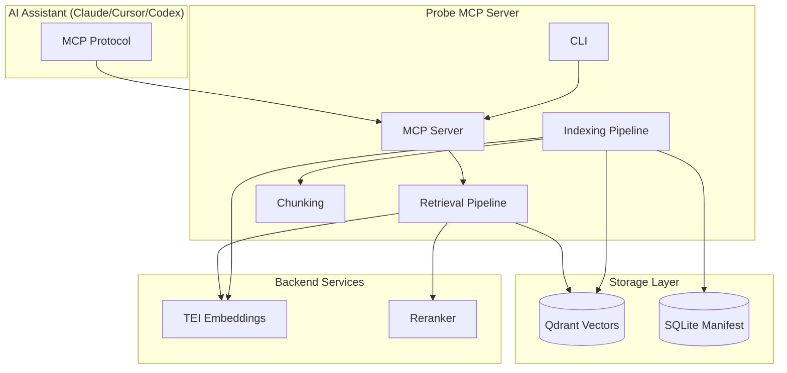
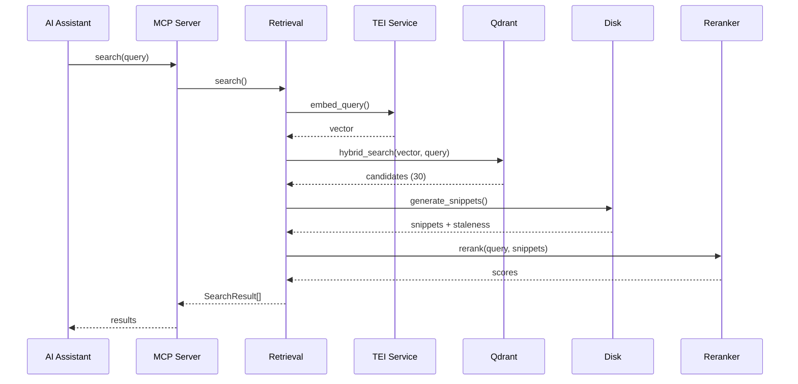
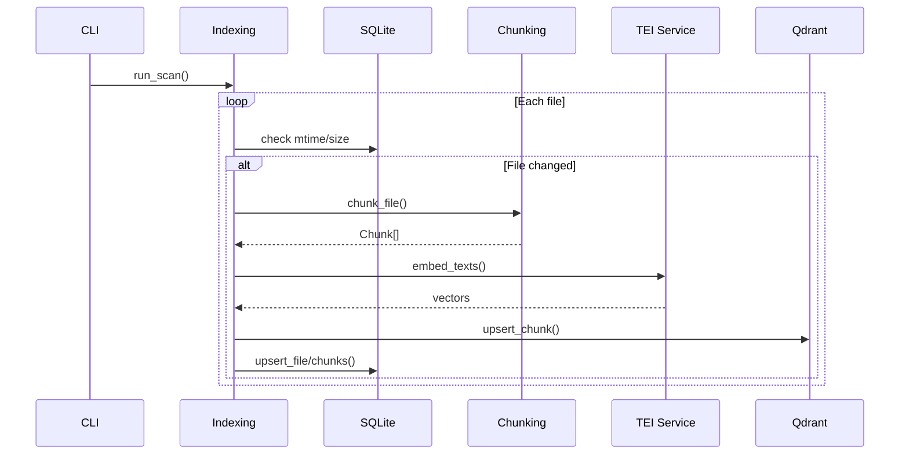

# Recon Report

> Auto-generated by Recon. Last mapped: 2026-01-29

## System Overview



Probe is an MCP server providing semantic code search for AI assistants. It indexes codebases using text embeddings (TEI), stores vectors in Qdrant, and supports hybrid dense+sparse retrieval with optional cross-encoder reranking.

## Entrypoints

| Entry | Type | Evidence |
|-------|------|----------|
| [probe/cli.py](probe/cli.py) | pyproject.toml scripts | `probe = "probe.cli:app"` |
| [probe/__main__.py](probe/__main__.py) | module execution | `python -m probe` |
| [probe/server.py](probe/server.py) | MCP server | Started via `probe serve` |

## Config Surface

| Category | Files |
|----------|-------|
| Package | [pyproject.toml](pyproject.toml) |
| Docker | [deploy/docker-compose.yml](deploy/docker-compose.yml), [services/reranker/Dockerfile](services/reranker/Dockerfile) |
| Linting | [pyproject.toml](pyproject.toml) (ruff + mypy config) |
| MCP | [.mcp.json.example](.mcp.json.example) |

## Environment Surface

| Variable | Used In | Required |
|----------|---------|----------|
| QDRANT_URL | config.py | No (default: http://127.0.0.1:6333) |
| TEI_EMBED_URL | config.py | No (default: http://127.0.0.1:8080) |
| RERANKER_URL | config.py | No (auto-enabled for balanced/pro) |
| PROBE_PRESET | config.py | No (default: lite) |
| MODEL_ID | services/reranker/main.py | No (default: Qwen3-Reranker) |
| PORT | services/reranker/main.py | No (default: 8083) |

## API Surface

### MCP Tools

| Tool | Description | Parameters |
|------|-------------|------------|
| `search` | Semantic code search | query, top_k, mode, instruction, filters |
| `open_file` | Read file lines with sandbox validation | path, start_line, end_line |
| `index_status` | Get indexing health stats | none |

### CLI Commands

| Command | Description | Status |
|---------|-------------|--------|
| `probe init [PATH]` | Initialize workspace | Implemented |
| `probe serve [PATH]` | Start MCP server | Implemented |
| `probe scan [PATH]` | Trigger full index scan | Not implemented |
| `probe prune` | Remove stale workspaces | Not implemented |
| `probe doctor` | Health checks | Not implemented |

### HTTP Endpoints (Reranker Service)

| Method | Path | Description |
|--------|------|-------------|
| POST | /rerank | Rerank documents by relevance |
| GET | /health | Health check |

## Test Coverage

| Module | Test File | Coverage |
|--------|-----------|----------|
| probe/cli.py | tests/test_cli.py | Commands tested |
| probe/config.py | tests/test_config.py | Config loading tested |
| probe/server.py | tests/test_server.py | open_file tested |
| probe/storage/manifest.py | tests/test_storage.py | CRUD operations tested |
| probe/chunking/ | tests/test_chunking.py | Detection + chunking tested |
| probe/retrieval.py | - | No tests |
| probe/indexing.py | - | No tests |
| services/reranker/ | - | No tests |

## Directory Structure

```
probe/
├── __init__.py          # Package init, version
├── __main__.py          # Module entry point
├── cli.py               # Typer CLI commands
├── config.py            # Configuration loading
├── types.py             # Pydantic models (Chunk, SearchResult, etc.)
├── server.py            # MCP server implementation
├── retrieval.py         # Search pipeline (embed → search → rerank)
├── indexing.py          # Index pipeline (scan → chunk → embed → store)
├── chunking/
│   ├── __init__.py      # Strategy dispatcher
│   ├── text.py          # Markdown + line-based fallback
│   └── tree_sitter.py   # AST-aware code chunking
└── storage/
    ├── __init__.py      # Module exports
    ├── manifest.py      # SQLite file/chunk tracking
    └── qdrant.py        # Vector database client

services/
└── reranker/
    ├── main.py          # FastAPI reranker service
    ├── Dockerfile       # Container build
    └── requirements.txt # Dependencies

deploy/
└── docker-compose.yml   # Service orchestration (lite/balanced/pro profiles)

tests/
├── conftest.py          # Shared fixtures
├── test_cli.py          # CLI tests
├── test_config.py       # Config tests
├── test_server.py       # MCP server tests
├── test_storage.py      # Storage tests
└── test_chunking.py     # Chunking tests
```

## Module Guide

### probe/types.py

**Purpose**: Shared Pydantic models for type safety across modules

**Key exports**:
- `ChunkKind` - Enum (CODE, DOC, CONFIG)
- `Chunk` - File chunk with content and location
- `IndexedChunk` - Stored chunk with point_id and hash
- `SearchResult` - Search result with score and signals
- `IndexStatus` - Index health status
- `WorkspaceConfig` - Workspace UUID and settings

**Dependencies**: None (foundation module)

---

### probe/config.py

**Purpose**: Configuration management for workspace and runtime settings

**Key exports**:
- `ProbeConfig` - Runtime config from environment
- `init_workspace()` - Create new workspace
- `load_workspace_config()` - Load from .probe/config.json

**Dependencies**: types.py

---

### probe/chunking/

**Purpose**: Convert source files into semantic chunks

**Strategy**:
1. Tree-sitter AST parsing (functions, classes)
2. Markdown heading-based chunks
3. Line-based fallback with overlap

**Key exports**:
- `chunk_file(content, path)` - Main entry point
- `SUPPORTED_LANGUAGES` - Set of supported languages

**Dependencies**: types.py

---

### probe/storage/

**Purpose**: Persistence layer for vectors and metadata

**Components**:
- `QdrantClient` - Vector database with hybrid search
- `Manifest` - SQLite for file tracking and staleness

**Key patterns**:
- Preset-specific collections (chunks_lite, chunks_balanced, chunks_pro)
- BM25 with `language="none"` for code
- UUIDv5 point IDs from position (not content)

**Dependencies**: types.py

---

### probe/retrieval.py

**Purpose**: Search pipeline orchestrating dense, sparse, fusion, and reranking

**Flow**:
1. Embed query with instruction prefix (Qwen3 optimization)
2. Hybrid search (dense + BM25 with RRF fusion)
3. Generate snippets from disk
4. Optional rerank (quality mode)

**Key exports**:
- `search()` - Main search function
- `embed_query()` - Get query embedding
- `rerank()` - Rerank documents

**Dependencies**: config.py, storage/, types.py

---

### probe/indexing.py

**Purpose**: Index pipeline from file scanning to vector storage

**Flow**:
1. Scan files (respecting .gitignore patterns)
2. Check staleness via mtime/size
3. Chunk with tree-sitter or fallback
4. Embed via TEI
5. Store in Qdrant + manifest

**Key exports**:
- `run_scan()` - Full incremental scan
- `index_file()` - Index single file

**Dependencies**: chunking/, config.py, storage/, types.py

---

### probe/server.py

**Purpose**: MCP server implementation

**Tools**:
- `search` - Semantic code search (not yet wired)
- `open_file` - Read file with sandbox validation
- `index_status` - Health status (stub)

**Key patterns**:
- stdio transport for MCP
- Global project root state
- Symlink resolution for security

**Dependencies**: types.py

---

### services/reranker/

**Purpose**: Cross-encoder reranking microservice

**Models supported**:
- Qwen3-Reranker (LM-style yes/no scoring)
- zerank-2 (sentence-transformers cross-encoder)

**Dependencies**: FastAPI, transformers, torch

## Data Flow

### Search Flow



### Indexing Flow



## Conventions

**Naming**:
- snake_case for functions and variables
- PascalCase for classes
- Constants in UPPER_CASE

**Error Handling**:
- Silent fallback for non-critical failures (rerank, binary files)
- Raise for configuration errors
- Return error text in MCP responses

**Line Numbers**:
- 1-indexed in external APIs
- 0-indexed internally (Python convention)

**Paths**:
- Path objects throughout
- Converted to strings only for JSON serialization

## Gotchas

**Point IDs are position-based**: UUIDv5 computed from workspace_id + file_path + line_range. Content changes don't change the ID, but line shifts do.

**BM25 uses no stemming**: `language="none"` is intentional for code search where `user` != `users`.

**Rerank failures are silent**: Falls back to fusion order on any exception.

**stdout is MCP protocol**: All logging must go to stderr when running serve.

**Preset affects collection**: Switching presets requires full reindex (different dimensions).

**Snippets read from disk**: Always fresh, staleness detected via chunk_hash comparison.

## Navigation Guide

**To add a new MCP tool**:
1. Add to `list_tools()` in [probe/server.py](probe/server.py)
2. Add handler function `handle_<tool_name>()`
3. Add case to `call_tool()` dispatcher

**To add a new CLI command**:
1. Add function with `@app.command()` in [probe/cli.py](probe/cli.py)
2. Add test in [tests/test_cli.py](tests/test_cli.py)

**To support a new language for chunking**:
1. Add to `SUPPORTED_LANGUAGES` in [probe/chunking/tree_sitter.py](probe/chunking/tree_sitter.py)
2. Add semantic node types to `SEMANTIC_NODES`
3. Test with sample file

**To add a new preset**:
1. Add to `PRESET_CONFIG` in [probe/storage/qdrant.py](probe/storage/qdrant.py)
2. Add TEI service in [deploy/docker-compose.yml](deploy/docker-compose.yml)
3. Update CLI help text

## Health Summary

### Test Coverage Gaps

| Module | Issue | Priority |
|--------|-------|----------|
| probe/retrieval.py | No test file | High |
| probe/indexing.py | No test file | High |
| services/reranker/ | No tests | Medium |

### Incomplete Features

From TODO comments and stubs:
- `probe scan` - Not implemented
- `probe prune` - Not implemented
- `probe doctor` - Not implemented
- `serve --watch` - Watch mode not implemented
- `handle_search` - Returns placeholder
- `handle_index_status` - Returns hardcoded stub

### Tech Debt

| Location | Issue |
|----------|-------|
| probe/cli.py | 4 TODOs for unimplemented commands |
| probe/server.py | 2 TODOs for search and status |
| probe/storage/qdrant.py | 1 TODO for tracking individual ranks |

**TODO Distribution**: 8 total (6 in probe/, 1 in probe/storage/, 1 in root)

### Unused Code Candidates

| File/Export | Confidence | Evidence |
|-------------|------------|----------|
| probe/retrieval.py | High | Not imported by server (search not wired) |
| probe/indexing.py | High | Not imported by CLI (scan not implemented) |
| get_workspace_id() | Medium | No references found |
| get_neighbor_chunks() | Medium | No references found |
| set/get_workspace_meta() | Medium | No references found |

### Dependency Health

No circular dependencies. Clean unidirectional graph:
```
types.py (foundation)
    ↓
config.py, chunking/, storage/
    ↓
indexing.py, retrieval.py
    ↓
server.py
    ↓
cli.py
```

## Suggested First Actions

1. **Wire search handler** - `probe/server.py:handle_search` returns placeholder. Connect to retrieval pipeline.

2. **Implement scan command** - `probe/cli.py:scan` is marked TODO. Wire to `indexing.run_scan()`.

3. **Add retrieval tests** - No tests for the core search functionality.

4. **Add indexing tests** - No tests for the indexing pipeline.

5. **Implement index_status** - `probe/server.py:handle_index_status` returns hardcoded stub. Wire to manifest/qdrant.
